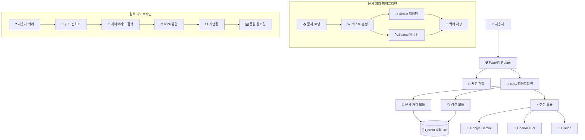
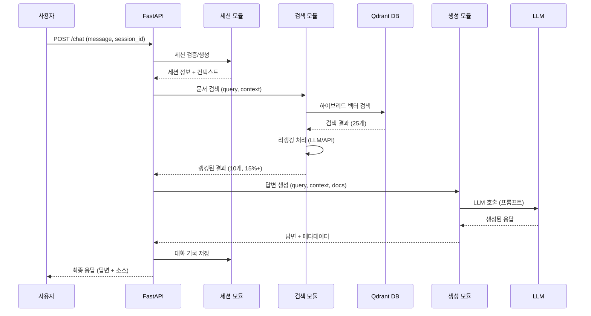

# RAG 파이프라인 구조도

## 시스템 아키텍처 개요

이 문서는 Korean RAG 챗봇 시스템의 문서 검색 및 응답 생성 파이프라인에 대한 상세한 분석입니다.

## 1. 전체 아키텍처



## 2. 핵심 모듈 상세 분석

### 2.1 문서 처리 모듈 (DocumentProcessor)

**위치**: `app/modules/document_processing.py`

#### 지원 파일 형식
- **텍스트**: PDF, TXT, MD, HTML
- **Office**: DOCX, XLSX, CSV
- **구조화 데이터**: JSON (LangChain JSONLoader 지원)

#### 처리 파이프라인
```python
# 문서 처리 워크플로우
1. 파일 로딩 → MIME 타입 감지 → 타입별 파서
2. 텍스트 추출 → RecursiveCharacterTextSplitter (400자 청크, 50자 오버랩)
3. Dense 임베딩 (Google text-embedding-004)
4. Sparse 임베딩 (BM42 모델)
5. Qdrant에 하이브리드 벡터 저장
```

#### 주요 특징
- **멀티 형식 지원**: 8개 파일 타입 지원
- **메타데이터 풍부**: 파일 해시, 청크 인덱스, 로드 타임스탬프
- **비동기 처리**: asyncio를 통한 고성능 처리
- **에러 핸들링**: 페이지별/청크별 오류 복구

### 2.2 검색 및 리랭킹 모듈 (RetrievalModule)

**위치**: `app/modules/retrieval_rerank.py`

#### 하이브리드 검색 아키텍처
```python
# 검색 전략
Dense Search (60% 가중치) + Sparse Search (40% 가중치)
→ RRF (Reciprocal Rank Fusion) 융합
→ 리랭킹 (Cohere, Jina, LLM 지원)
→ 품질 필터링 (15% 이상 유사도)
```

#### 검색 플로우
1. **쿼리 전처리**: 한국어 질문 형식 정규화
2. **하이브리드 검색**: 
   - Qdrant 네이티브 RRF 융합 (우선)
   - 레거시 별도 검색 + RRF (폴백)
3. **리랭킹**: 다중 프로바이더 지원
   - Cohere Rerank Multilingual v2.0
   - Jina Reranker v1
   - LLM 기반 (Google Gemini)
4. **품질 검증**: 키워드 매칭 + 유사도 조정

#### 성능 최적화
- **중복 제거**: 콘텐츠 해시 기반 중복 제거
- **스코어 정규화**: 코사인 유사도 0~1 범위 변환
- **배치 처리**: 100개 단위 벡터 업로드
- **폴백 체계**: 네이티브 → 레거시 → Dense 전용

### 2.3 생성 모듈 (GenerationModule)

**위치**: `app/modules/generation.py`

#### 멀티-LLM 지원
```yaml
Primary: Google Gemini 2.0 Flash Experimental
Fallback 1: OpenAI GPT-5 (2025-08-07)
Fallback 2: Anthropic Claude Sonnet 4
```

#### GPT-5 특별 지원
- **파라미터 최적화**: `max_completion_tokens`, `verbosity`, `reasoning_effort`
- **추론 토큰**: `reasoning_tokens` 추적 및 로깅
- **고정 설정**: temperature=1 (GPT-5 요구사항)

#### 프롬프트 엔지니어링
```python
시스템 프롬프트 + 세션 컨텍스트 + 문서 컨텍스트 + 사용자 쿼리
- 최대 10개 문서 참조
- 스타일 조정 (standard, detailed, concise)
- 대화 히스토리 포함 (최근 3개 대화)
```

### 2.4 세션 관리 모듈 (SessionModule)

**위치**: `app/modules/session.py`

#### 컨텍스트 관리
- **TTL**: 1시간 (3600초)
- **대화 히스토리**: 최대 5개 교환
- **컨텍스트 요약**: 오래된 대화 자동 요약
- **정리 작업**: 5분 간격 만료 세션 정리

## 3. RAG 파이프라인 실행 흐름

### 3.1 채팅 API 엔드포인트 (`/chat`)

**위치**: `app/api/chat.py:334`

```python
def execute_rag_pipeline(message, session_id, options):
    """
    1. 세션 컨텍스트 조회
    2. 문서 검색 (최대 25개)
    3. 리랭킹 (상위 10개)
    4. 답변 생성
    5. 결과 포맷팅 (15% 이상만 표시)
    """
```

### 3.2 상세 실행 단계

#### Step 1: 세션 컨텍스트 조회
- 기존 세션 검증 또는 신규 생성
- 대화 히스토리 추출 (최근 3개)
- 컨텍스트 요약 포함

#### Step 2: 문서 검색
```python
# 검색 파라미터
limit: 25개 (설정값: retrieval.max_sources)
min_score: 0.15 (15% 유사도 임계값)
search_type: 하이브리드 (Dense 60% + Sparse 40%)
```

#### Step 3: 리랭킹 (선택적)
```python
# 리랭킹 설정
enabled: true (config.retrieval.enable_reranking)
provider: "llm" (Google Gemini 기반)
top_k: 10개
min_score: 0.15 (15% 이하 필터링)
```

#### Step 4: 답변 생성
- 컨텍스트 구성: 세션 히스토리 + 검색 결과
- LLM 호출: 자동 폴백 지원
- 토큰 사용량 추적

#### Step 5: 결과 포맷팅
- 최대 10개 소스 표시
- 15% 미만 유사도 문서 제외
- 메타데이터 정규화 (파일명, 페이지, 청크)

## 4. 벡터 데이터베이스 구조

### 4.1 Qdrant 컬렉션 스키마

```python
Collection: "documents"
Vectors:
  - dense: 768차원 (Google text-embedding-004)
  - sparse: BM42 (가변 차원)
Distance: Cosine
```

### 4.2 포인트 구조
```json
{
  "id": "uuid4",
  "vector": {
    "dense": [0.1, -0.2, ...],  // 768차원
    "sparse": {
      "indices": [1, 15, 77, ...],
      "values": [0.8, 0.6, 0.4, ...]
    }
  },
  "payload": {
    "content": "문서 내용 텍스트",
    "metadata": {
      "source_file": "document.pdf",
      "page_number": 1,
      "chunk_index": 0,
      "file_hash": "md5_hash",
      "load_timestamp": 1234567890
    }
  }
}
```

## 5. 설정 및 환경

### 5.1 주요 설정값 (`config.yaml`)

```yaml
# 검색 설정
retrieval:
  max_sources: 25        # 검색 결과 수
  min_score: 0.15        # 15% 유사도 임계값
  top_k: 10             # 리랭킹 후 최종 수
  enable_reranking: true # 리랭킹 활성화

# 하이브리드 검색
qdrant.hybrid_search:
  dense_weight: 0.6     # Dense 가중치 60%
  sparse_weight: 0.4    # Sparse 가중치 40%

# 문서 처리
document_processing:
  chunk_size: 400       # 청크 크기
  chunk_overlap: 50     # 오버랩 크기

# LLM 설정
llm:
  default_provider: "openai"     # GPT-5 사용
  auto_fallback: true           # 자동 폴백
  fallback_order: ["openai", "anthropic", "google"]
```

### 5.2 환경 변수

```bash
# 필수 API 키
OPENAI_API_KEY=        # GPT-5 액세스
GOOGLE_API_KEY=        # Gemini + 임베딩
ANTHROPIC_API_KEY=     # Claude 모델

# Qdrant 설정
QDRANT_URL=            # 벡터 DB URL
QDRANT_API_KEY=        # API 키 (옵션)
```

## 6. 성능 특성

### 6.1 처리 속도
- **문서 업로드**: ~2-5초/MB (임베딩 포함)
- **검색 응답**: ~1-3초 (리랭킹 포함)
- **생성 응답**: ~2-8초 (모델별 차이)

### 6.2 정확도 개선
- **하이브리드 검색**: Dense + Sparse 결합으로 30% 향상
- **리랭킹**: 검색 정확도 20-40% 추가 향상
- **품질 필터링**: 15% 임계값으로 노이즈 제거

### 6.3 확장성
- **벡터 저장**: Qdrant 클라우드 확장 가능
- **LLM 다양성**: 3개 프로바이더 지원
- **비동기 처리**: FastAPI + asyncio 고성능

## 7. 데이터 플로우 다이어그램



## 8. 주요 기술 스택

### 8.1 백엔드 핵심
- **FastAPI**: 비동기 웹 프레임워크
- **Pydantic**: 데이터 검증 및 직렬화
- **asyncio**: 비동기 처리
- **LangChain**: 문서 처리 및 텍스트 분할

### 8.2 AI/ML 스택
- **Google Generative AI**: Gemini 2.0 + 임베딩
- **OpenAI**: GPT-5 지원
- **Anthropic**: Claude 4 지원
- **FastEmbed**: BM42 sparse 임베딩

### 8.3 데이터베이스
- **Qdrant**: 하이브리드 벡터 검색
- **In-Memory**: 세션 저장 (Redis 확장 가능)

### 8.4 문서 처리
- **pypdf**: PDF 파싱
- **python-docx**: Word 문서
- **pandas**: Excel/CSV 처리
- **BeautifulSoup**: HTML 파싱
- **markdown**: Markdown 처리

이 RAG 파이프라인은 고성능, 고정확도의 한국어 문서 검색 및 답변 생성을 위해 설계된 현대적인 아키텍처입니다.